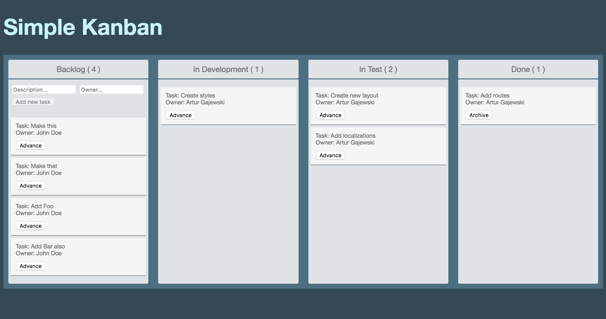

# Simple Kanban

A simple Kanban board created with ClojureScript/Reagent.

### Prerequisites

* Java JDK
* [Leiningen](http://leiningen.org/)

### Usage

To start this application:

    $ lein figwheel

Open your browser at [http://localhost:3449](http://localhost:3449)

## About

The license is MIT.